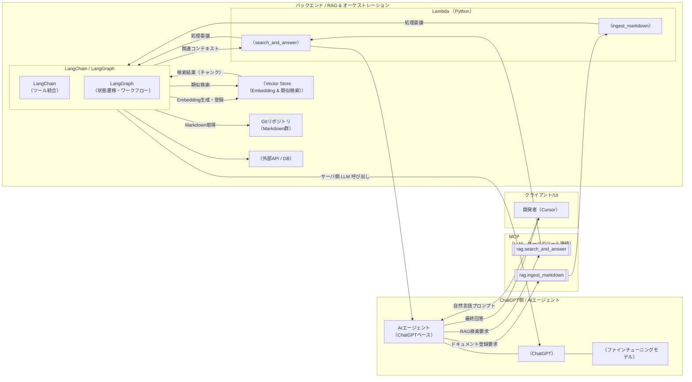

# 関係図_ワークフロー図

```mermaid
flowchart LR
    %% UI層
    subgraph Client[クライアント/UI]
        Dev[開発者（Cursor）]
    end

    %% LLM・エージェント層
    subgraph AgentLayer[ChatGPT側 / AIエージェント]
        Agent[AIエージェント<br>（ChatGPTベース）]
        ChatGPT[（ChatGPT）]
        FT[（ファインチューニングモデル）]
        Agent --- ChatGPT
        ChatGPT --- FT
    end

    %% MCP層
    subgraph MCP[MCP<br>（LLM→サーバのツール接続）]
        ToolRAG[[rag.search_and_answer]]
        ToolIngest[[rag.ingest_markdown]]
    end

    %% サーバ側（Lambda + LangChain + LangGraph）
    subgraph Backend[バックエンド / RAG & オーケストレーション]
        
        %% オーケストレーション層
        subgraph Orchestrator[LangChain / LangGraph]
            LC[LangChain<br>（ツール統合）]
            LG[LangGraph<br>（状態遷移・ワークフロー）]
        end
        
        %% Lambda エントリポイント
        subgraph Lambda[Lambda （Python）]
            LambdaIngest[（ingest_markdown）]
            LambdaSearch[（search_and_answer）]
        end

        %% データ層
        VS[（Vector Store<br>（Embedding & 類似検索））]
        Git[Gitリポジトリ<br>（Markdown群）]
        ExtAPI[（外部API / DB）]
    end

    %% UI → エージェント
    Dev -->|自然言語プロンプト| Agent

    %% エージェント → MCP（ツール呼び出し）
    Agent -->|RAG検索要求| ToolRAG
    Agent -->|ドキュメント登録要求| ToolIngest

    %% MCP → Lambda
    ToolIngest --> LambdaIngest
    ToolRAG --> LambdaSearch

    %% Lambda → LangChain/LangGraph
    LambdaIngest -->|処理委譲| Orchestrator
    LambdaSearch -->|処理委譲| Orchestrator

    %% Orchestrator <-> データ層
    Orchestrator -->|Markdown取得| Git
    Orchestrator -->|Embedding生成・登録| VS

    Orchestrator -->|類似検索| VS
    VS -->|検索結果（チャンク）| Orchestrator

    %% LangChain / LangGraph → 外部API
    Orchestrator --> ExtAPI

    %% Orchestrator → LLM（必要なら）
    Orchestrator -->|サーバ側 LLM 呼び出し| ChatGPT

    %% 最終的に ChatGPT 側エージェントへ返す
    Orchestrator -->|関連コンテキスト| LambdaSearch
    LambdaSearch --> Agent
    Agent -->|最終回答| Dev
```
