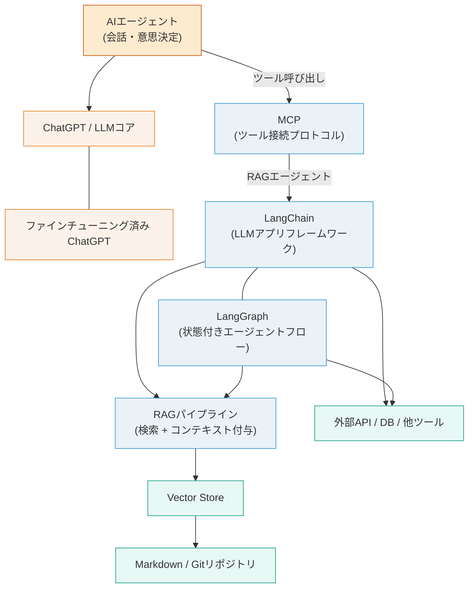

# 概念図

誰が誰を拡張しているのか。

```mermaid
graph TD
    ChatGPT["ChatGPT / LLMコア"]
    FT["ファインチューニング済み ChatGPT"]
    Agent["AIエージェント<br>(会話・意思決定)"]
    MCP["MCP<br>(ツール接続プロトコル)"]
    LC["LangChain<br>(LLMアプリフレームワーク)"]
    LG["LangGraph<br>(状態付きエージェントフロー)"]
    RAG["RAGパイプライン<br>(検索 + コンテキスト付与)"]
    VS["Vector Store"]
    Docs["Markdown / Gitリポジトリ"]
    Tools["外部API / DB / 他ツール"]

    %% LLM コアとエージェント
    Agent --> ChatGPT
    ChatGPT --- FT

    %% MCP 経由でサーバ側へ
    Agent -->|ツール呼び出し| MCP
    MCP -->|RAGエージェント| LC
    LC --- LG

    %% LangChain / LangGraph 内で RAG を構成
    LC --> RAG
    LG --> RAG
    RAG --> VS
    VS --> Docs
    LC --> Tools
    LG --> Tools

    classDef llm fill:#fdf2e9,stroke:#e67e22;
    classDef agent fill:#fdebd0,stroke:#d35400;
    classDef infra fill:#eaf2f8,stroke:#3498db;
    classDef data fill:#e8f8f5,stroke:#16a085;

    class ChatGPT,FT llm;
    class Agent agent;
    class MCP,LC,LG,RAG infra;
    class VS,Docs,Tools data;

```
