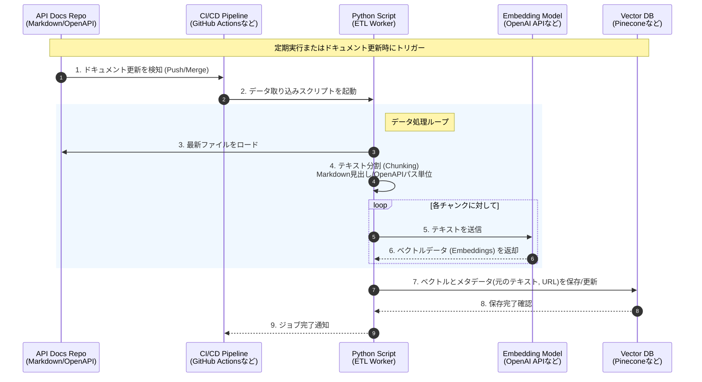

```mermaid
sequenceDiagram
    autonumber
    participant Repo as API Docs Repo<br>(Markdown/OpenAPI)
    participant CICD as CI/CD Pipeline<br>(GitHub Actionsなど)
    participant ETL as Python Script<br>(ETL Worker)
    participant EmbedAPI as Embedding Model<br>(OpenAI APIなど)
    participant VDB as Vector DB<br>(Pineconeなど)

    Note over Repo, VDB: 定期実行またはドキュメント更新時にトリガー

    Repo->>CICD: 1. ドキュメント更新を検知 (Push/Merge)
    CICD->>ETL: 2. データ取り込みスクリプトを起動

    rect rgb(240, 248, 255)
    note right of ETL: データ処理ループ
    ETL->>Repo: 3. 最新ファイルをロード
    ETL->>ETL: 4. テキスト分割 (Chunking)<br>Markdown見出し/OpenAPIパス単位
    
    loop 各チャンクに対して
        ETL->>EmbedAPI: 5. テキストを送信
        EmbedAPI-->>ETL: 6. ベクトルデータ (Embeddings) を返却
    end
    end

    ETL->>VDB: 7. ベクトルとメタデータ(元のテキスト, URL)を保存/更新
    VDB-->>ETL: 8. 保存完了確認
    ETL-->>CICD: 9. ジョブ完了通知
```